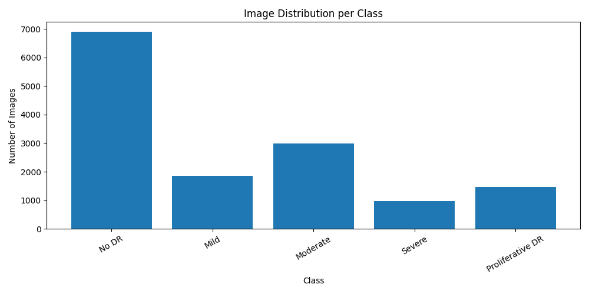
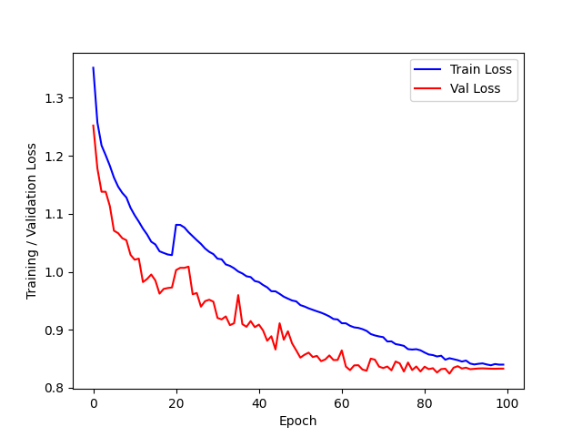
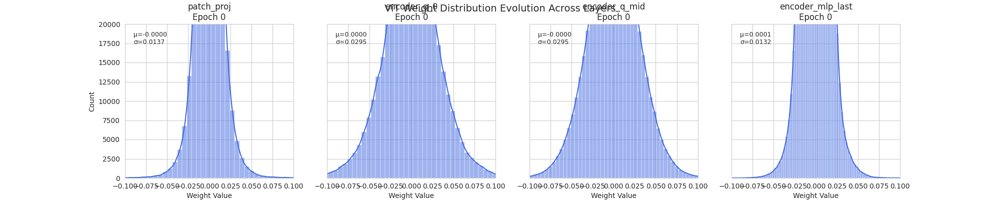
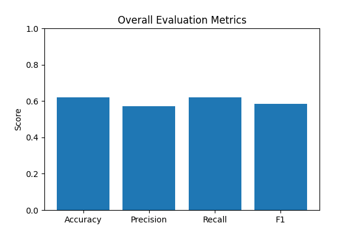
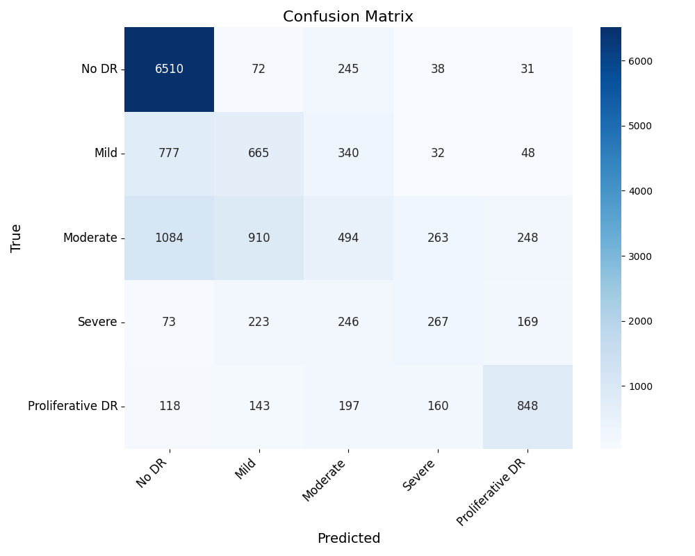

# ViTransformer Classificator

Trained Vision Transformer on the Retinopathy Dataset [Dataset](https://www.kaggle.com/datasets/ascanipek/eyepacs-aptos-messidor-diabetic-retinopathy). The model is pretrained on Imagenet and then finetuned. 

**Class Distribution** (class imbalance)

**Loss**

**Weight Distribution**

## Pre-Quantisation

**Metric**

**Confusion Matrix**

## After-Quantisation
TODO

## Testing
- High Accuracy ViT Base Model
- Mid Accuracy ViT Base Model
- Overfitted ViT Base Model
- Check if quantisation has regularisation effect on overfitted Model
- Check how accuracy drops compared to high/mid accuracy models
- UMAP feature space base model vs quantised model comparision

## TODO
- [x] Evaluation Script
- [x] Inference Script
- [x] Plot Loss
- [x] Validation Loop
- [ ] Quantisation 
- [ ] Test Quantisation
- [x] Refactor Code
- [x] Save model parameters during training in txt file
- [ ] Measure model size, speedup, ...
- [ ] Fix class imbalance, black borders in images
- [ ] Visualise Attention Head for prediction of base and quantized model
- [ ] Apply Roofline model for evaluation

## Version
- CUDA 12.6
- NVIDIA RTX 3090 Ti (Driver Version: 580.95.05)
- Pytorch 2.10.0.dev20251208+cu126
- torchao 0.16.0+git51fd90e50
