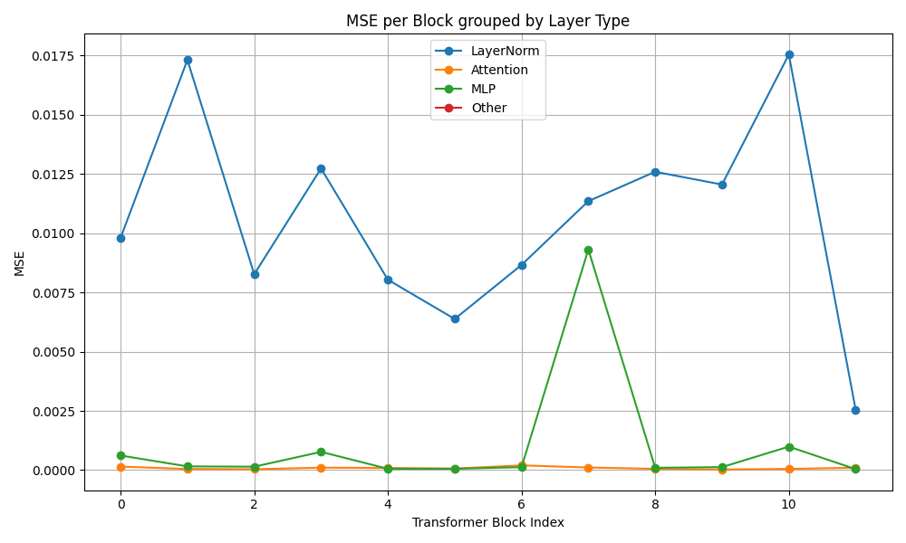
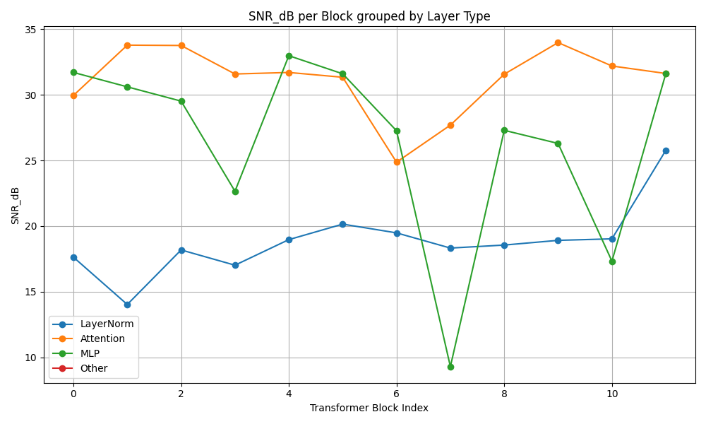

# ViTransformer Classificator

Trained Vision Transformer on the Retinopathy Dataset [Dataset](https://www.kaggle.com/datasets/ascanipek/eyepacs-aptos-messidor-diabetic-retinopathy).

## Installation
```bash
pip install -r requirements.txt
```

## Model
The own implementation of a ViT is under the directory src/model/vit.py.

The dinov2 model is under the directory src/dino_vit.py

## Quantized Linear Layer
The implementation of the asymmetric QuantizedLinearLayer is under src/quant/quantLayer_asym.py

The implementation of the symmetric QuantizedLinearLayer is under src/quant/quantLayer_sym.py

## Dataset Distribution
**Class Distribution** (class imbalance)


## Training
There are 2 finetuning scripts. Training arguments can be changed inside the scripts!
To train the Vision Transformer:
```bash
python3 finetune.py
```

To train the DINO Vision Transformer:
```bash
python3 finetune_dino.py
```

**Loss**


**Weight Distribution**


## Evaluation
To evaluate the trained model simply set the weights path in the file and run:
```bash
python quantization_evaluation.py
```
This script automatically runs the evaluation on the FP32 model and creates a quantized Model and runs the 
evaluation again.

## Analyse Weight and Activation Distribution
To analyse the weight and activation distribution of the model you can run these 2 scripts:
```bash
python3 analyse_weights_distribution.py
python3 analyse_activations_distribution.py
```

## Block sensitivity



## UMAP
To create the UMAP analysis run:
```bash
python3 umap_features.py
```

## Pre-Quantisation

**Metric**


**Confusion Matrix**


## Version
- CUDA 12.6
- NVIDIA RTX 3090 Ti (Driver Version: 580.95.05)
- Pytorch 2.10.0.dev20251208+cu126
- torchao 0.16.0+git51fd90e50
